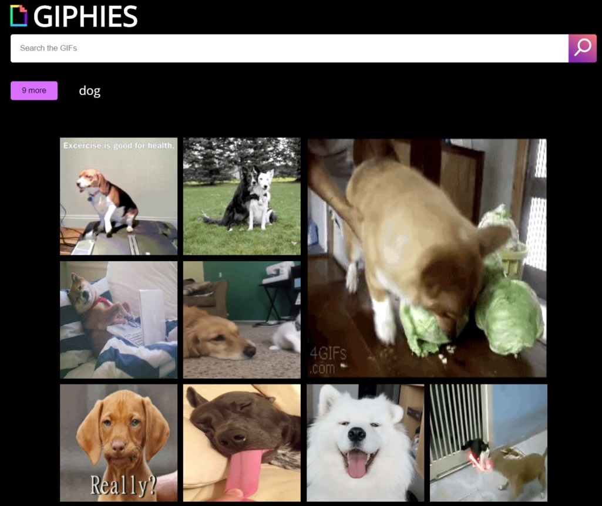

# Projekt III - Giphies

## Cel projektu:
Celem projektu było stworzenie strony służącej do wyszukiwania gifów. Jest to już trzeci projekt, powstały w ramach kursu organizowanego przez CodersCamp, a jego zadaniem było utrwalenie poznanego materiału dotyczącego JavaScriptu na frontendzie.

## Demo
Strona dostępna jest pod adresem: https://justyna782.github.io/Projekt-III/

Jest to strona typu one page. Logo wraz z paskiem wyszukiwania - tzw. searchbar - przyklejono do góry viewportu, co ma ułatwić użytkownikowi wyszukiwanie nowych gifów, które wyświetlają się na środku w widoku głównym. Ponadto kliknięcie na logo, przewija stronę do góry.

## W trakcie tworzenia projektu wykorzystano m.in.:
* Metody uzyskiwania dostępu do elementów DOM,
* Tworzenie elementów DOM,
* Komunikacja z REST'owym API,
* Asynchroniczne operacje z wykorzystaniem metody fetch(),
* Koncepcje zdarzeń i podstawowe metody tworzenia zdarzeń,
* Selektory CSS,
* Popularne tagi HTML,
* Podpinanie CSS do dokumentów HTML,
* Podpinanie skryptów do dokumentów HTML,
* Zapisywanie kolorów,
* Stylowanie tekstu,
* Zewnętrzne ikony/fonty,
* Grid,
* Position.

